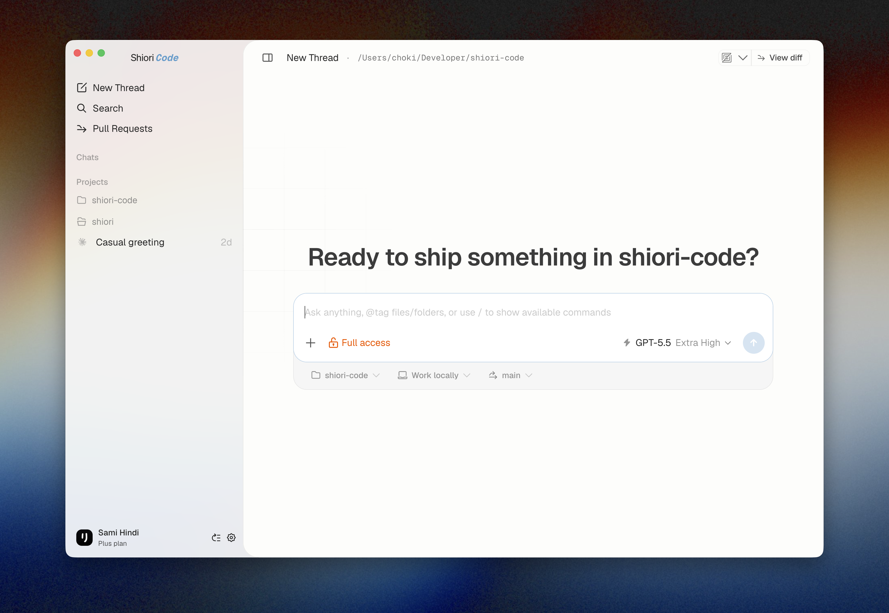
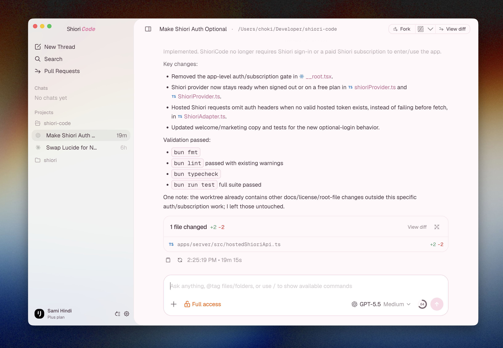

# ShioriCode

ShioriCode is a desktop and web interface for running coding agents in real projects.

It is built for long-running agent sessions, visible work history, predictable reconnects, project-aware threads, and reviewable changes. The goal is simple: keep powerful coding agents usable when the work takes more than one prompt.

ShioriCode is early, changing quickly, and currently best suited for people who are comfortable running a Bun monorepo locally.

## Screenshots

<table>
  <tr>
    <td width="50%">
      
    </td>
    <td width="50%">
      
    </td>
  </tr>
</table>

## What It Does

- Runs coding-agent sessions from a local desktop or browser UI.
- Keeps chats tied to projects, branches, and local workspaces.
- Streams agent activity into a readable timeline.
- Shows generated diffs and changed files without leaving the app.
- Supports local provider CLIs and a hosted Shiori provider.
- Includes desktop, web, CLI, terminal-agent, and marketing surfaces in one repo.

## Project Status

ShioriCode is not a polished public platform yet. It is source-available, actively evolving, and maintainer-directed.

Expect sharp edges around setup, provider support, release packaging, and hosted Shiori configuration. Bug fixes, reliability improvements, documentation fixes, and focused polish are welcome.

## Providers

You only need one working provider to use the app.

| Provider | Requirement                                                                             | Authentication        |
| -------- | --------------------------------------------------------------------------------------- | --------------------- |
| Codex    | [Codex CLI](https://github.com/openai/codex)                                            | `codex login`         |
| Claude   | [Claude Code](https://docs.anthropic.com/en/docs/agents-and-tools/claude-code/overview) | `claude auth login`   |
| Kimi     | [Kimi Code CLI](https://www.moonshot.cn/) (`kimi`)                                      | `kimi login`          |
| Shiori   | Convex-backed hosted provider setup                                                     | Sign in from Settings |

## Requirements

- [Bun](https://bun.sh/) `^1.3.9`
- [Node.js](https://nodejs.org/) `^24.13.1`
- Optional: a `NUCLEO_LICENSE_KEY` from [nucleoapp.com](https://nucleoapp.com/) for the full Nucleo icon set
- At least one authenticated provider CLI, unless you are only working on non-provider surfaces

If no Nucleo license key is available, ShioriCode falls back to Lucide icons so local development still works.

## Quick Start

Create a local environment file first:

```bash
cp .env.example .env
```

If you have a Nucleo license key, set it before starting the app:

```bash
NUCLEO_LICENSE_KEY=your-license-key
```

Install dependencies and start the app:

```bash
bun install
bun run dev
```

The default dev command starts the server and web app together.

## Running The App

Use these commands for the common local workflows:

| Command               | Description                            |
| --------------------- | -------------------------------------- |
| `bun run dev`         | Start server and web app together      |
| `bun run dev:web`     | Start only the web app                 |
| `bun run dev:server`  | Start only the server                  |
| `bun run dev:desktop` | Start the desktop development workflow |

For remote access from another device, see [REMOTE.md](./REMOTE.md).

## Development

| Command                 | Description                     |
| ----------------------- | ------------------------------- |
| `bun run fmt`           | Format the repo                 |
| `bun run lint`          | Run Oxlint                      |
| `bun run typecheck`     | Type-check all packages         |
| `bun run test`          | Run Vitest and browser tests    |
| `bun run build`         | Build all packages              |
| `bun run build:desktop` | Build the desktop pipeline      |
| `bun run convex:dev`    | Start Convex development server |

Do not use `bun test` in this repo. Use `bun run test`.

Before considering a change complete, run:

```bash
bun run fmt
bun run lint
bun run typecheck
```

For tests, always run:

```bash
bun run test
```

## Repository Layout

This is a Bun monorepo managed with Turborepo.

```text
apps/
  agent/       Terminal agent UI
  cli/         CLI tooling
  desktop/     Electron desktop shell
  marketing/   Astro marketing site
  server/      Node.js WebSocket server and provider broker
  web/         React/Vite app
convex/        Hosted Shiori backend schema and functions
packages/
  contracts/   Effect schemas and TypeScript contracts
  effect-acp/  ACP protocol helpers
  shared/      Runtime utilities with explicit subpath exports
scripts/       Build, release, and development tooling
```

## Architecture Notes

ShioriCode is currently Codex-first. The server starts `codex app-server` for provider sessions, speaks JSON-RPC over stdio, and projects provider runtime activity into orchestration events consumed by the web client.

Good starting points:

- `apps/server/src/codexAppServerManager.ts`
- `apps/server/src/providerManager.ts`
- `apps/server/src/wsServer.ts`
- `apps/web/src/store.ts`
- `packages/contracts/src`
- `packages/shared/src`

Reference docs:

- [Codex App Server docs](https://developers.openai.com/codex/sdk/#app-server)
- [Release process](./docs/release.md)
- [Remote server notes](./REMOTE.md)
- [Keybindings](./KEYBINDINGS.md)

## Contributing

Read [CONTRIBUTING.md](./CONTRIBUTING.md) before opening a pull request. Small, focused PRs are much more likely to be reviewed and merged than broad rewrites or speculative features.

## Security

ShioriCode launches local tools, brokers coding-agent sessions, and handles provider credentials. Please read [SECURITY.md](./SECURITY.md) before reporting security issues or publishing details.

## Acknowledgements

ShioriCode is a fork of [t3code](https://github.com/pingdotgg/t3code). We are grateful to the t3code project for serving as an excellent base for ShioriCode.

## License

ShioriCode is source-available under the [Elastic License 2.0](./LICENSE).

You may use ShioriCode for personal, internal, professional, and commercial work. You may not sell, resell, white-label, rebrand, or offer ShioriCode as a hosted or managed service without a separate commercial license from the maintainers.

Because this license restricts some commercial redistribution and hosted-service use, ShioriCode should be described as source-available rather than OSI open source.
